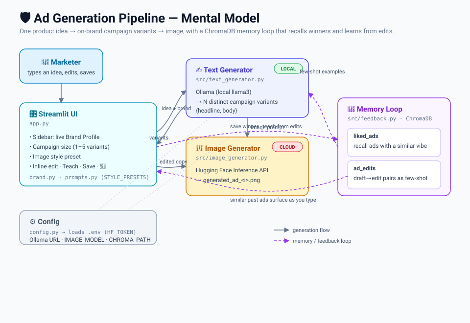

# Ad Generation Pipeline

A multi-modal ad generation pipeline. It pairs a **local LLM** (Ollama) for ad copy with a **cloud image model** (Hugging Face Inference API), wraps it in a **Streamlit** UI, and adds a **ChromaDB** memory loop that both remembers ads you liked and learns from how you edit drafts.

The default brand profile (`src/brand.py`) is pre-tuned to the brand's voice and audience, so out of the box it writes copy for products like video KYC, document verification, liveness detection, and background checks. Edit the brand live in the sidebar to retune.

## Architecture



## What it does

- **Campaign generation** — one product idea produces several *distinct* variants (benefit-led, problem-led, social-proof, urgency) for A/B testing. Choose 1–5 in the sidebar.
- **Inline editing** — tweak any variant's headline and body directly in the UI; no regeneration needed.
- **Learns from your edits** — "Teach from my edits" stores each draft→edit pair. Future campaigns pull the most semantically similar past edits in as few-shot examples, so copy drifts toward your preferred style over time.
- **Liked-ads recall** — "Save winner" stores an ad; as you type a new idea, past ads with a similar vibe surface automatically (semantic search, not keywords).
- **Image style presets** — render the visual for any variant in Photorealistic, Comic book, 3D render, Flat vector, or Watercolor styles (`STYLE_PRESETS` in `src/prompts.py`).

```
ad-generation-pipeline/
├── .env                 # Your secret HF token (NEVER commit). Create it yourself (see Quick start).
├── .gitignore           # Ignores .env, venv, chroma_db/, generated images, caches.
├── mental-model.svg     # Architecture diagram (shown above).
├── requirements.txt     # Python dependencies.
├── config.py            # Loads settings + secrets from .env.
├── app.py               # The Streamlit UI — run this.
└── src/
    ├── __init__.py
    ├── brand.py             # brand profile: voice, audience, values.
    ├── prompts.py           # LangChain prompt templates + image STYLE_PRESETS.
    ├── text_generator.py    # Ollama → campaign variants + image prompt.
    ├── image_generator.py   # Hugging Face → the actual image.
    └── feedback.py          # ChromaDB: liked-ads recall + learns-from-edits loop.
```

## Quick start

```bash
python -m venv venv
source venv/bin/activate          # Windows: venv\Scripts\Activate.ps1
pip install -r requirements.txt

# Local LLM
# Install Ollama from https://ollama.com, then:
ollama pull llama3

# Secrets — create .env in the project root with your Hugging Face Read token:
#   HF_TOKEN=hf_your_token_here
```

## Test each piece (in order)

```bash
python -m src.text_generator      # prints ad copy + a 3-variant campaign → LLM works
python -m src.image_generator     # saves generated_ad.png → images work
streamlit run app.py              # opens the full UI
```

## Notes

- **Ollama** runs locally at `http://localhost:11434` — no API key, no per-request cost.
  If Python says "connection refused", run `ollama serve` and confirm the model name in
  `config.py` matches `ollama list` exactly (case-sensitive).
- **Hugging Face** is the only cloud piece. A free **Read** token works for prototyping.
  A `401` means the token is missing/wrong; never commit `.env`.
- **Image model fallbacks** — if `stabilityai/stable-diffusion-xl-base-1.0` 404s, switch
  `IMAGE_MODEL` in `config.py` to `black-forest-labs/FLUX.1-schnell` or
  `stabilityai/stable-diffusion-2-1`. Check a model's page for the "Inference Providers"
  widget to confirm it's callable.
- **ChromaDB** stores liked ads and draft→edit pairs in `chroma_db/` (gitignored) and
  finds similar ones by meaning, not keywords. Both the recall and the learning loop are
  cold-start safe — with nothing saved yet, they simply contribute nothing.
